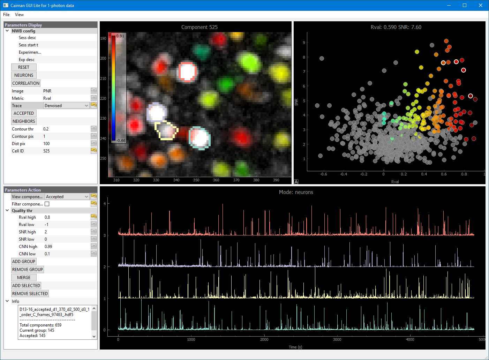
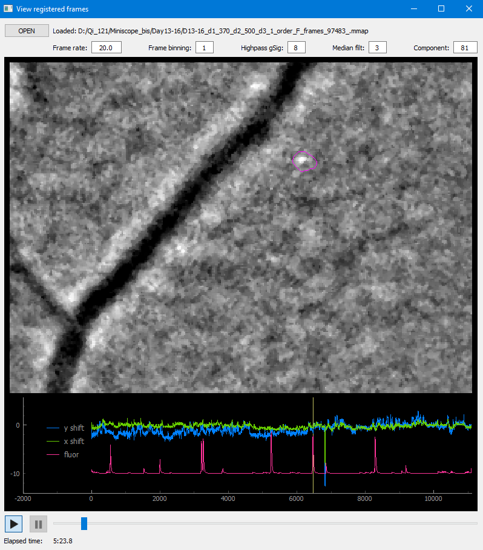

# CaimanGUI
GUI for visualizing CaImAn processed imaging data.

[CaImAn](https://github.com/flatironinstitute/CaImAn) is a powerful computational software to process one-photon and multi-photon imaging data. CaimanGUI provides a complementary visulizing functionality that helps neuroscientists to curate their processed imaging data.

## Installation
Follow the instructions for installing CaInAm [here](https://github.com/flatironinstitute/CaImAn/blob/main/docs/source/Installation.rst). Then, you can download the CaimanGUI source codes or
```
git clone https://github.com/chenhungling/CaimanGUI
cd CaimanGUI/gui
```
CaimanGUI is built upon [pyqtgraph](https://pyqtgraph.readthedocs.io/en/latest/) that is included in the CaImAn package. Thus, you can simply run CaimanGUI in `caiman` environment (assume you call `caiman` for your CaImAn installation):
```
conda activate caiman
python caiman_gui.py
```
You can also run `caiman_gui.py` under [Spyder](https://www.spyder-ide.org/). However, you will need to set: menu Run/Configuration per file/Execute in an external system termal, to avoid conflict between Spyder's interactive console and Qt's event loop.

## Getting started

### Using the GUI
<p align="center" width=100%>
  
</p>

CaimanGUI is mainly designed for visualizing CaImAn processed one-photon imaging data (it should also work for two-photon data). The implemented functionalities are partly inspired by the widely used [Suite2p](https://github.com/MouseLand/suite2p) software for two-photon data.

### Motion-corrected movie
<p align="center" width=100%>
  
</p>

You can also visualize the motion-corrected movie (menu View/Movie) together with the fluorescence trace of a selected cell and the corrected in-plane shifts. Note that reading a F-order memory-mapped file is faster than a C-order memory-mapped file.

### Outputs

CaimanGUI output is simply a list of accepted cells IDs (`accepted_list`).